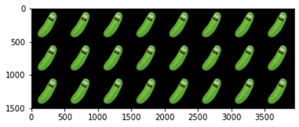
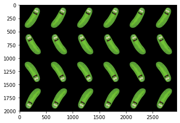
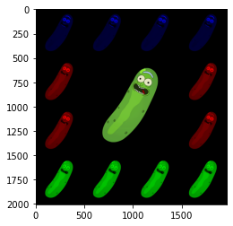

# Project: Image manipulation in Numpy

## Overview

In this exercise, you should look for an image that you will use to do some manipulations with. It is highly important that you do all your image manipulations using the raw image data in Numpy (and do not use the PIL object - if you don't know what a PIL object is, no problem - you don't need it). We have done an exercise together as an example for this assignment.

## Detailed assignment

**Assignment: Setting Up Project and Developing a Production Simulation Program**

In this assignment, you will follow a series of steps to set up your project, set up version control using Git, create an environment, and develop a Python program for image manipulation

**Step 1: Initialize Git Repository**

Initialize a git repository on your personal GitHub account to track changes and collaborate effectively. You can add your notebook and files into this git repo. Add me as a collaborator so I can see the code you created.

If you don't succeed in creating the GIT repo - don't panic.  Send your zipped project files to olivier@python.exposed.

**Step 2: Create Environment**

Create a new Jupyter notebook file.  Ensure that you install only the necessary packages required for the project (if not already present).

**Step 3: Choose & load image**

Choose an image that you want to do the manipulations for. You could use the following code to read in this image and get the underlying numpy object.

```python
from PIL import Image
from matplotlib.pyplot as plt
import numpy as np
import os

loc_input_img = os.path.join('..', 'data', 'input', 'pickle_rick.png')
np_image = np.array(image)
plt.imshow(np_image)
plt.show()
```
I chose the following image:

<div style="text-align:center">
  
</div>

**Step 4: Do image manipulations**

Use Numpy to create all of the following manipulated versions of the original image:

<div style="text-align:center">
  
</div>

<div style="text-align:center">
  
</div>

<div style="text-align:center">
  
</div>

**Step 5: Generalize these manipulations**
Generalize the image manipulations that you created in **Step 4**, generalize to the following (or even more general if you want):
 - Define a function `grid_with_flips(image, matrix)`, where `matrix` is a matrix containing the type of flips that you do with your image. You could say `0` for you image not flipped, `1` for flipping your image left right, `2` for flipping it upside down and `3` for flipping it both left right and upside down. For example the first two sets of images you created in **Step 4** would be the result of using the matrix: `[[1 for i in range(7)] for j in range(3)]` and `[[j for i in range(7)] for j in range(4)]`.
 - Define a function `create_colorful_big_one(colors)` where `colors` is a list of colors (starting left top and rotating clockwise). The image from `Step 4` is the result of calling the function `create_colorful_big_one(['b', 'b', 'b', 'b', 'r', 'r', 'g', 'g', 'g', 'g', 'r', 'r'])`.

 Can you also think of a way in which you could combine these two functions to create a single function that allows you to create (a combination of) the above manipulations?

 ***Remark:*** While I talk about "a single function", it is *not* best practice to create one single function containing all code, but rather create many small functions which are all combined in other function(s). Each function should do one thing, and your final function should simply combine those functionalities based on your input.

Replace the code your wrote in **Step 4** by 3 simple function calls from the function(s) you defined in this step. Please also make sure to organize & document your code after completing this part.

**Step 6: Your own manipulations**

Choose 2 more ways in which you manipulate your image and implement them.

Good luck!
